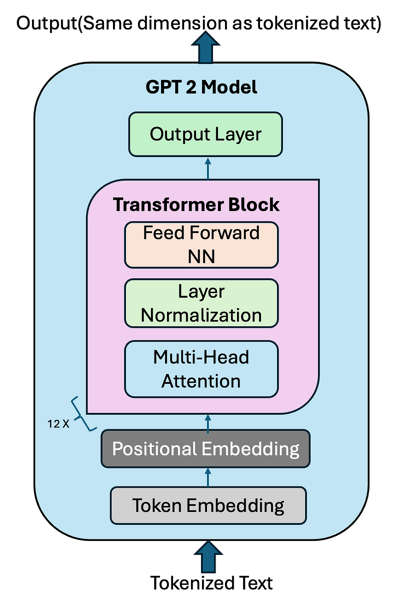

# GPT2 Hasktorch implementation

The goal of this project is to reproduce GPT-2, created by OpenAI, in the Haskell programming language using the Hasktorch library, drawing inspiration from Andrej Karpathy's implementation in PyTorch.

**Haskell** : https://www.haskell.org/

**Haskorch** : http://hasktorch.org/

**Nano GPT(Karpathy's implementation)** : https://github.com/karpathy/nanoGPT

**GPT2 Paper** : https://cdn.openai.com/better-language-models/language_models_are_unsupervised_multitask_learners.pdf

<br>


<div align="center">
	
</div>


## GPT2 Parameters

| Parameters       | Value         |
|----------------|---------------|
| nBlock      | 12       |
| nHead        | 12      |
| nEmbd      | 768         |
| vocabSize      | 50 257         |
| nbParameters      | 117M          |
| seqLen      | 1024          |
| activation     | gelu          |
| optimizer     | Adam         |

## Features

- All modules of GPT2 ✅
- Forward Pass ✅
- Backward Pass ✅
- LazyDataloader to manage big txt files ✅
- variable learning rate ✅
- complete training ✅
- use gradient accumation ✅
- Save the training state ✅
- Performant training tracker ✅
- Plot metrics in real time ✅
- Load and use real GPT2 tokenizer ✅


## TODOs

- Variable Batch Size ❌
- Weights sharing between the input token embedding layer (wte) and the output language modeling head (lm_head) ❌
- Use Weights Decay ❌
- Use Flash Attention ❌
- Use Distributed Data Parallel ❌
- Generation Function
  


## Launch the program

```bash
docker compose up -d  # launch the docker
```

```bash
stack run  # launch the main
```

```bash
stack test # launch the tests
```


## use Jupyter
```http://localhost:8890/lab```

